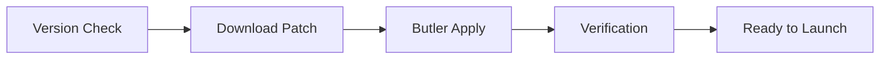

# Features and Capabilities

HyPrism provides an extensive set of features for casual players and power users alike.

---

## Table of Contents

- [Identification and Profile Management](#-identification-and-profile-management)
- [Game Client Management](#-game-client-management)
- [Mod System](#-mod-system)
- [User Interface](#-user-interface)
- [Integrations](#-integrations)
- [Localization](#-localization)
- [Logging and Diagnostics](#-logging-and-diagnostics)
- [Configuration](#-configuration)

---

## 👤 Identification and Profile Management

### Profile System

| Feature | Description |
|---------|-------------|
| **Multiple Profiles** | Create and switch between multiple profiles |
| **Customization** | Change nickname and avatar |
| **Independent Settings** | Each profile stores its own settings |
| **Session Saving** | Secure token storage for automatic login |

### Services

- `ProfileService` — profile storage and loading
- `ProfileManagementService` — high-level operations
- `UserIdentityService` — UUID and identity management
- `SkinService` — custom skins

---

## 🎮 Game Client Management

### Smart Updates



| Component | Function |
|-----------|----------|
| **VersionService** | Get available versions list |
| **ButlerService** | Differential patches via itch.io Butler |
| **DownloadService** | Download with progress display |
| **ClientPatcher** | Binary patching of executables |

### Binary Patching

`ClientPatcher` — critical component for:
- Applying fixes to game client
- Enabling additional features
- File integrity verification via hashes

### Multiple Versions

```
Instances/
├── release/
│   ├── latest/          # Auto-updated version
│   └── v123/            # Pinned version
└── pre-release/
    └── latest/
```

### Launch Parameters

- JVM arguments (if needed)
- Custom launch flags
- Environment variables

---

## 🔧 Mod System

### Mod Manager

| Feature | Description |
|---------|-------------|
| **Mod Search** | Search on CurseForge and other sources |
| **One-Click Install** | Automatic download and installation |
| **Dependency Resolution** | Automatic installation of dependent mods |
| **Removal** | Complete removal with cleanup |

### Service

```csharp
public class ModService
{
    Task<List<ModInfo>> SearchModsAsync(string query);
    Task InstallModAsync(ModInfo mod, string instancePath);
    Task UninstallModAsync(string modId, string instancePath);
    List<InstalledMod> GetInstalledMods(string instancePath);
}
```

---

## 🖥️ User Interface

### Design

- **Dark Theme** — modern dark design
- **Glass Effects** — semi-transparent elements
- **Adaptive Layout** — adjusts to window size
- **Smooth Animations** — transitions and effects

### Components

| Category | Components |
|----------|------------|
| **Buttons** | PrimaryButton, IconButton, CloseButton |
| **Cards** | NewsCard, NoticeCard |
| **Inputs** | TextBox, ComboBox, Slider |
| **Navigation** | Sidebar, Tabs |
| **Layouts** | Modal, Overlay, Grid |

### Overlay System

```csharp
// DashboardViewModel
[ObservableProperty] bool IsSettingsOpen;
[ObservableProperty] bool IsProfileEditorOpen;
[ObservableProperty] bool IsModManagerOpen;
```

### Theming

- **Accent Color** — user customizable
- **ThemeService** — dynamic theme application
- **Color Palette** — via XAML resources

```csharp
ThemeService.Instance.ApplyAccentColor("#FF5500");
```

---

## 🌐 Integrations

### Discord Rich Presence

| State | Display |
|-------|---------|
| In Launcher | "Browsing launcher" |
| Downloading | "Downloading update..." |
| In Game | "Playing Hytale" |

```csharp
_discordService.UpdatePresence("Playing Hytale", $"Version {version}");
```

### News Feed

- Load news from Hytale.com
- Render in `NewsCard` components
- Caching for offline mode

### Integration Services

| Service | Purpose |
|---------|---------|
| `DiscordService` | Discord RPC |
| `NewsService` | News loading |
| `GitHubService` | Launcher update checks |
| `BrowserService` | Open external links |

---

## 🌍 Localization

### Supported Languages

| Code | Language |
|------|----------|
| `en-US` | English |
| `ru-RU` | Русский |
| `de-DE` | Deutsch |
| `es-ES` | Español |
| `fr-FR` | Français |
| `ja-JP` | 日本語 |
| `ko-KR` | 한국어 |
| `pt-BR` | Português (Brasil) |
| `tr-TR` | Türkçe |
| `uk-UA` | Українська |
| `zh-CN` | 简体中文 |
| `be-BY` | Беларуская |

### Reactive Switching

```csharp
// Change language without restart
LocalizationService.Instance.CurrentLanguage = "ru-RU";

// Reactive subscription
LocalizationService.Instance.GetObservable("button.play")
    .Subscribe(text => PlayButtonText = text);
```

### File Format

`Assets/Locales/{code}.json`:
```json
{
  "_langName": "English",
  "_langCode": "en-US",
  "button": {
    "play": "Play",
    "settings": "Settings"
  }
}
```

### Fallback

When translation is missing, `en-US` is automatically used.

---

## 📊 Logging and Diagnostics

### Logger

```csharp
Logger.Info("Category", "Message");
Logger.Success("Download", "Completed!");
Logger.Error("Launch", $"Failed: {ex.Message}");
Logger.Progress("Download", 50, "Downloading...");
```

### Log Files

- Path: `{AppDir}/Logs/{timestamp}.log`
- Format: Serilog structured logging

---

## ⚙️ Configuration

### Config.cs

```csharp
public class Config
{
    public string UUID { get; set; }
    public string Nick { get; set; }
    public string VersionType { get; set; }  // "release" or "pre-release"
    public string? AccentColor { get; set; }
    public string Language { get; set; }
    public bool DiscordRPC { get; set; }
    // ...
}
```

### Configuration Path

| OS | Path |
|----|------|
| Windows | `%APPDATA%/HyPrism/config.json` |
| Linux | `~/.config/HyPrism/config.json` |
| macOS | `~/Library/Application Support/HyPrism/config.json` |

---

## 📚 Additional Resources

- [Architecture.md](../Technical/Architecture.md) — System architecture
- [ServicesReference.md](../Technical/ServicesReference.md) — Services reference
- [UIComponentGuide.md](../Development/UIComponentGuide.md) — Creating components
