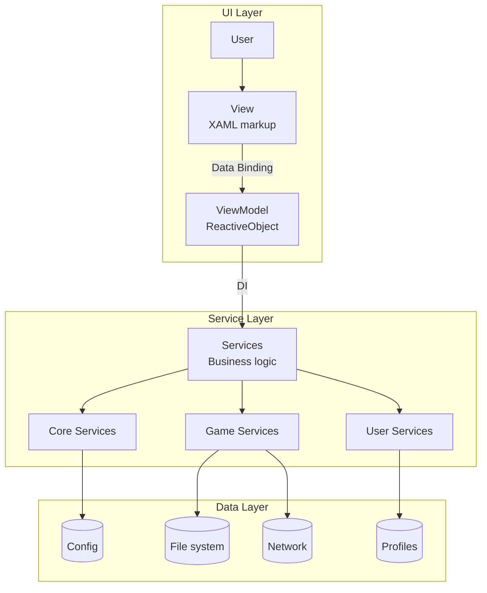
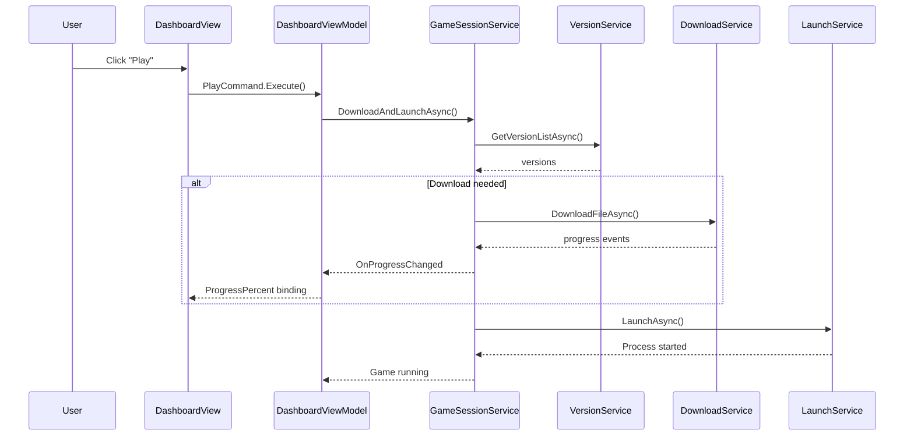
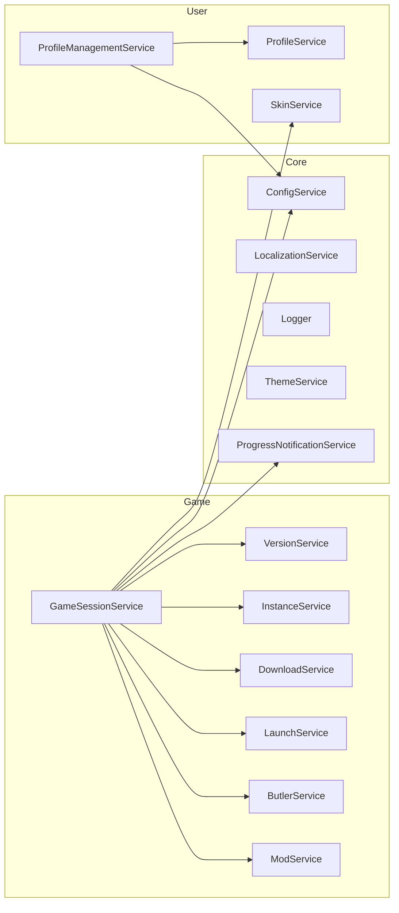

# System Architecture

HyPrism uses the **Model-View-ViewModel (MVVM)** pattern with strict separation of UI and business logic.

> **Migration:** The project transitioned from Photino (WebKit) to Avalonia UI. See [MigrationGuide.md](MigrationGuide.md).

---

## Table of Contents

- [High-Level Overview](#-high-level-overview)
- [Architecture Layers](#-architecture-layers)
- [Dependency Injection](#-dependency-injection)
- [Libraries and Dependencies](#-libraries-and-dependencies)
- [Data Flow: Game Launch](#-data-flow-game-launch)
- [Key Components](#-key-components)
- [Diagrams](#-diagrams)

---

## 🏗️ High-Level Overview



---

## 📦 Architecture Layers

### 1. Presentation Layer (UI)

**Location:** `UI/`

| Component | Description |
|-----------|-------------|
| **Views** | Full-screen XAML views (`DashboardView`, `SettingsView`) |
| **Components** | Reusable UI elements (`PrimaryButton`, `NewsCard`) |
| **MainWindow** | Main window and root `MainViewModel` |
| **Converters** | Value Converters for data transformation |
| **Styles** | Global styles and animations |

**Principles:**
- Code-behind is minimal (only constructor)
- All logic in ViewModel
- `x:DataType` for compile-time binding verification

### 2. ViewModel Layer

**Location:** `UI/Views/*/`, `UI/MainWindow/`, `UI/Components/*/`

ViewModels inherit from `ReactiveObject` and use:
- `[ObservableProperty]` — reactive properties
- `[RelayCommand]` — UI commands
- `WhenAnyValue` — reactive subscriptions
- `ObservableAsPropertyHelper` — computed properties

**Key ViewModels:**

| ViewModel | Responsibility |
|-----------|----------------|
| `MainViewModel` | Root VM, owns Loading and Dashboard |
| `DashboardViewModel` | Main UI state, overlay management |
| `SettingsViewModel` | Application settings |
| `LoadingViewModel` | Loading screen |

### 3. Service Layer

**Location:** `Services/`

Services are organized by domains:

```
Services/
├── Core/           # Infrastructure (Config, Logger, Localization)
├── Game/           # Game logic (Launch, Download, Mods)
└── User/           # User (Profile, Skin)
```

**Principles:**
- Singleton pattern via DI
- Single Responsibility (SRP)
- Services don't depend on UI

### 4. Model Layer

**Location:** `Models/`

Models are simple POCO classes:
- `Config` — application configuration
- `Profile` — user profile
- `ModInfo` — mod information
- `InstalledInstance` — installed game instance

---

## 💉 Dependency Injection

HyPrism uses `Microsoft.Extensions.DependencyInjection`.

### Bootstrapper.cs

```csharp
public static class Bootstrapper
{
    public static IServiceProvider Initialize()
    {
        var services = new ServiceCollection();
        
        // Infrastructure
        services.AddSingleton(new AppPathConfiguration(appDir));
        services.AddSingleton<HttpClient>();
        
        // Core Services
        services.AddSingleton<ConfigService>();
        services.AddSingleton<LocalizationService>();
        services.AddSingleton<Logger>();
        
        // Game Services
        services.AddSingleton<GameSessionService>();
        services.AddSingleton<VersionService>();
        services.AddSingleton<LaunchService>();
        
        // User Services
        services.AddSingleton<ProfileService>();
        services.AddSingleton<SkinService>();
        
        // ViewModels
        services.AddSingleton<MainViewModel>();
        services.AddSingleton<DashboardViewModel>();
        services.AddTransient<SettingsViewModel>();
        
        return services.BuildServiceProvider();
    }
}
```

### Resolving Dependencies

```csharp
// In App.axaml.cs
Services = Bootstrapper.Initialize();
var mainVm = Services.GetRequiredService<MainViewModel>();

// In ViewModel via constructor
public DashboardViewModel(
    GameSessionService gameSession,
    ConfigService config,
    LocalizationService localization)
{
    _gameSession = gameSession;
    _config = config;
    _localization = localization;
}
```

---

## 📚 Libraries and Dependencies

| Library | Version | Purpose |
|---------|---------|---------|
| **Avalonia** | 11.3.11 | UI Framework |
| **ReactiveUI** | 11.3.9 | Reactive MVVM |
| **CommunityToolkit.Mvvm** | 8.4.0 | Source Generators |
| **SkiaSharp** | 3.116.1 | Graphics rendering |
| **Serilog** | 4.3.0 | Logging |
| **Newtonsoft.Json** | 13.0.3 | JSON serialization |
| **M.E.DependencyInjection** | 10.0.2 | DI container |

---

## 🔄 Data Flow: Game Launch



### Detailed Process

1. **View:** User clicks "Play" button
2. **ViewModel:** `PlayCommand` calls `GameSessionService.DownloadAndLaunchAsync()`
3. **GameSessionService:**
   - Gets version list via `VersionService`
   - Determines target version
   - Checks game presence via `InstanceService`
   - Downloads/updates via `ButlerService` + `DownloadService`
   - Applies mods via `ModService`
   - Applies skins via `SkinService`
   - Launches via `LaunchService`
4. **ViewModel:** Subscribed to `ProgressNotificationService.OnProgressChanged`
5. **View:** UI updates automatically via binding

---

## 🗂️ Key Components

### GameSessionService

**File:** `Services/Game/GameSessionService.cs` (~1000 lines)

Orchestrator of the entire game launch process. Coordinates:
- Version acquisition
- Downloading and patching
- Mod and skin application
- Process launch

### ClientPatcher

**File:** `Services/Game/ClientPatcher.cs`

⚠️ **Critical component** — binary patching of game executable.

### LocalizationService

**File:** `Services/Core/LocalizationService.cs`

Reactive localization system with hot-reload language support.

---

## 📐 Diagrams

### Service Dependencies



---

## 📚 Additional Resources

- [MigrationGuide.md](MigrationGuide.md) — Migration from Photino
- [ServicesReference.md](ServicesReference.md) — Services reference
- [MVVMPatterns.md](../Development/MVVMPatterns.md) — MVVM Patterns
- [ProjectStructure.md](ProjectStructure.md) — Project structure
