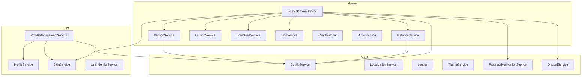

# Services Reference

> Complete reference guide for all HyPrism services with their responsibilities, dependencies, and usage examples.

---

## Table of Contents

- [Service Structure](#-service-structure)
- [Core Services](#-core-services)
  - [ConfigService](#configservice)
  - [LocalizationService](#localizationservice)
  - [Logger](#logger)
  - [ThemeService](#themeservice)
  - [ProgressNotificationService](#progressnotificationservice)
  - [NewsService](#newsservice)
  - [DiscordService](#discordservice)
- [Game Services](#-game-services)
  - [GameSessionService](#gamesessionservice)
  - [InstanceService](#instanceservice)
  - [VersionService](#versionservice)
  - [LaunchService](#launchservice)
  - [DownloadService](#downloadservice)
  - [ModService](#modservice)
  - [ClientPatcher](#clientpatcher)
  - [ButlerService](#butlerservice)
- [User Services](#-user-services)
  - [ProfileService](#profileservice)
  - [ProfileManagementService](#profilemanagementservice)
  - [SkinService](#skinservice)
  - [UserIdentityService](#useridentityservice)
- [Dependency Diagram](#-dependency-diagram)
- [Adding a New Service](#-adding-a-new-service)

---

## 📁 Service Structure

```
Services/
├── Core/           # Base infrastructure services
├── Game/           # Game-related services
└── User/           # User services
```

---

## 🔧 Core Services

### ConfigService

**File:** `Services/Core/ConfigService.cs`  
**Type:** Singleton  
**Responsibility:** Reading and writing application configuration

```csharp
public class ConfigService
{
    public Config Configuration { get; }
    public void Save();
    public void Reload();
}
```

**Usage:**
```csharp
// Read setting
var language = _configService.Configuration.Language;

// Modify and save
_configService.Configuration.AccentColor = "#FF5500";
_configService.Save();
```

**Configuration file path:**
- Windows: `%APPDATA%/HyPrism/config.json`
- Linux: `~/.config/HyPrism/config.json`
- macOS: `~/Library/Application Support/HyPrism/config.json`

---

### LocalizationService

**File:** `Services/Core/LocalizationService.cs`  
**Type:** Singleton (Instance pattern)  
**Responsibility:** Localization system with reactive updates

```csharp
public class LocalizationService : ReactiveObject
{
    public static LocalizationService Instance { get; }
    public string CurrentLanguage { get; set; }
    
    public string Translate(string key);
    public IObservable<string> GetObservable(string key);
    public static Dictionary<string, string> GetAvailableLanguages();
}
```

**Usage in ViewModel:**
```csharp
// Simple translation
var text = LocalizationService.Instance.Translate("button.play");

// Reactive translation (updates on language change)
LocalizationService.Instance.GetObservable("button.play")
    .Subscribe(text => PlayButtonText = text);
```

**Usage in XAML:**
```xml
<!-- Via converter -->
<TextBlock Text="{Binding Source={x:Static core:LocalizationService.Instance}, 
                          Path=CurrentLanguage, 
                          Converter={StaticResource TranslateConverter}, 
                          ConverterParameter=button.play}"/>
```

**Localization file format:** `Assets/Locales/{code}.json`
```json
{
  "_langName": "English",
  "_langCode": "en-US",
  "button": {
    "play": "Play",
    "settings": "Settings"
  }
}
```

---

### Logger

**File:** `Services/Core/Logger.cs`  
**Type:** Static class  
**Responsibility:** Centralized logging

```csharp
public static class Logger
{
    public static void Info(string category, string message);
    public static void Success(string category, string message);
    public static void Warning(string category, string message);
    public static void Error(string category, string message);
    public static void Debug(string category, string message);
    public static void Progress(string category, int percent, string message);
    public static List<string> GetRecentLogs(int count = 10);
}
```

**Usage:**
```csharp
Logger.Info("Download", "Starting download...");
Logger.Success("Download", "Download completed!");
Logger.Error("Download", $"Failed: {ex.Message}");
Logger.Progress("Download", 50, "Downloading game files");
```

**Output:** Console + file `Logs/{timestamp}.log`

---

### ThemeService

**File:** `Services/Core/ThemeService.cs`  
**Type:** Singleton (Instance pattern)  
**Responsibility:** Theme and accent color management

```csharp
public class ThemeService
{
    public static ThemeService Instance { get; }
    public void Initialize(string hexColor);
    public void ApplyAccentColor(string hexColor);
}
```

**Usage:**
```csharp
// At application start
ThemeService.Instance.Initialize("#FFA845");

// When changed in settings
ThemeService.Instance.ApplyAccentColor(newColor);
```

---

### ProgressNotificationService

**File:** `Services/Core/ProgressNotificationService.cs`  
**Type:** Singleton  
**Responsibility:** Centralized progress notifications

```csharp
public class ProgressNotificationService
{
    public event Action<DownloadProgress>? OnProgressChanged;
    
    public void ReportDownloadProgress(
        string phase, 
        int progress, 
        string message,
        string? detail = null,
        long downloadedBytes = 0,
        long totalBytes = 0);
}
```

**Usage:**
```csharp
// In service
_progressService.ReportDownloadProgress(
    "download", 
    50, 
    "Downloading game files...",
    "file.zip",
    1024 * 1024 * 50, // 50MB downloaded
    1024 * 1024 * 100  // 100MB total
);

// In ViewModel - subscription
_progressService.OnProgressChanged += progress =>
{
    DownloadProgress = progress.Percent;
    StatusText = progress.Message;
};
```

---

### NewsService

**File:** `Services/Core/NewsService.cs`  
**Type:** Singleton  
**Responsibility:** News loading and caching

```csharp
public class NewsService
{
    public Task<List<NewsItem>> GetNewsAsync(int count = 10);
    public List<NewsItem> GetCachedNews();
}
```

---

### DiscordService

**File:** `Services/Core/DiscordService.cs`  
**Type:** Singleton  
**Responsibility:** Discord Rich Presence

```csharp
public class DiscordService
{
    public void Initialize();
    public void UpdatePresence(string state, string details = null);
    public void ClearPresence();
    public void Dispose();
}
```

**Usage:**
```csharp
_discordService.Initialize();
_discordService.UpdatePresence("In Launcher", "Browsing mods");

// When launching game
_discordService.UpdatePresence("Playing Hytale", $"Version {version}");
```

---

## 🎮 Game Services

### GameSessionService

**File:** `Services/Game/GameSessionService.cs`  
**Type:** Singleton  
**Responsibility:** Orchestration of complete game launch cycle

**Dependencies:**
- ConfigService, InstanceService, VersionService
- UpdateService, LaunchService, ButlerService
- DownloadService, ModService, SkinService
- UserIdentityService, GameProcessService
- ProgressNotificationService, DiscordService

```csharp
public class GameSessionService
{
    public Task<DownloadProgress> DownloadAndLaunchAsync(
        Func<bool>? launchAfterDownloadProvider = null);
    public void RequestCancel();
}
```

**Execution flow:**
1. Get version list
2. Determine target version
3. Check game installation
4. Download/update if needed
5. Apply mods and skins
6. Launch game process

---

### InstanceService

**File:** `Services/Game/InstanceService.cs`  
**Type:** Singleton  
**Responsibility:** Game instance (version) management

```csharp
public class InstanceService
{
    public string ResolveInstancePath(string branch, int version, bool preferExisting);
    public bool IsClientPresent(string instancePath);
    public void SaveLatestInfo(string branch, int version);
    public LatestInstanceInfo? LoadLatestInfo(string branch);
    public void MigrateLegacyData();
}
```

**Directory structure:**
```
{AppDir}/
├── Instances/
│   ├── release/
│   │   ├── latest/        # Auto-updated instance
│   │   ├── v123/          # Pinned version
│   │   └── v124/
│   └── pre-release/
│       └── latest/
```

---

### VersionService

**File:** `Services/Game/VersionService.cs`  
**Type:** Singleton  
**Responsibility:** Game version management

```csharp
public class VersionService
{
    public Task<List<int>> GetVersionListAsync(string branch);
    public List<int> GetPatchSequence(int fromVersion, int toVersion);
    public string GetPatchUrl(string branch, int version);
}
```

---

### LaunchService

**File:** `Services/Game/LaunchService.cs`  
**Type:** Singleton  
**Responsibility:** Game process preparation and launch

```csharp
public class LaunchService
{
    public ProcessStartInfo BuildProcessStartInfo(
        string executablePath,
        LaunchOptions options);
    public Task<Process?> LaunchAsync(ProcessStartInfo startInfo);
}
```

---

### DownloadService

**File:** `Services/Game/DownloadService.cs`  
**Type:** Singleton  
**Responsibility:** File download with progress

```csharp
public class DownloadService
{
    public Task DownloadFileAsync(
        string url,
        string destinationPath,
        Action<long, long>? progressCallback = null,
        CancellationToken cancellationToken = default);
}
```

---

### ModService

**File:** `Services/Game/ModService.cs`  
**Type:** Singleton  
**Responsibility:** Mod management

```csharp
public class ModService
{
    public Task<List<ModInfo>> SearchModsAsync(string query);
    public Task<ModInfo?> GetModDetailsAsync(string modId);
    public Task InstallModAsync(ModInfo mod, string instancePath);
    public Task UninstallModAsync(string modId, string instancePath);
    public List<InstalledMod> GetInstalledMods(string instancePath);
}
```

---

### ClientPatcher

**File:** `Services/Game/ClientPatcher.cs`  
**Type:** Utility class  
**Responsibility:** Binary patching of game client

> ⚠️ **CRITICAL COMPONENT** — Modify only with full understanding of consequences!

```csharp
public static class ClientPatcher
{
    public static bool Patch(string executablePath, PatchConfig config);
    public static bool Verify(string executablePath);
    public static bool Restore(string executablePath);
}
```

---

### ButlerService

**File:** `Services/Game/ButlerService.cs`  
**Type:** Singleton  
**Responsibility:** itch.io Butler integration for differential updates

```csharp
public class ButlerService
{
    public Task EnsureButlerInstalledAsync(Action<int, string> progressCallback);
    public Task ApplyPatchAsync(string patchPath, string targetDir);
}
```

---

## 👤 User Services

### ProfileService

**File:** `Services/User/ProfileService.cs`  
**Type:** Singleton  
**Responsibility:** Profile data storage and loading

```csharp
public class ProfileService
{
    public Profile? GetActiveProfile();
    public List<Profile> GetAllProfiles();
    public void SaveProfile(Profile profile);
    public void DeleteProfile(string uuid);
}
```

---

### ProfileManagementService

**File:** `Services/User/ProfileManagementService.cs`  
**Type:** Singleton  
**Responsibility:** High-level profile operations

```csharp
public class ProfileManagementService
{
    public void InitializeProfileModsSymlink();
    public void SwitchProfile(int profileIndex);
    public Profile CreateNewProfile(string name);
}
```

---

### SkinService

**File:** `Services/User/SkinService.cs`  
**Type:** Singleton  
**Responsibility:** User skins

```csharp
public class SkinService
{
    public void TryRecoverOrphanedSkinOnStartup();
    public Task ApplySkinAsync(string instancePath, string skinPath);
    public string? GetCurrentSkinPath();
}
```

---

### UserIdentityService

**File:** `Services/User/UserIdentityService.cs`  
**Type:** Singleton  
**Responsibility:** User identification (UUID, nickname)

```csharp
public class UserIdentityService
{
    public string GetOrCreateUUID(string username);
    public string CurrentUsername { get; set; }
    public string CurrentUUID { get; }
}
```

---

## 🔗 Dependency Diagram



---

## 📝 Adding a New Service

1. **Create class** in appropriate folder (`Core/`, `Game/`, `User/`)
2. **Define dependencies** via constructor
3. **Register in Bootstrapper.cs:**

```csharp
// In Initialize() method
services.AddSingleton<MyNewService>();

// or with factory
services.AddSingleton(sp => new MyNewService(
    sp.GetRequiredService<ConfigService>(),
    sp.GetRequiredService<AnotherService>()
));
```

4. **Inject** into ViewModel or other services
