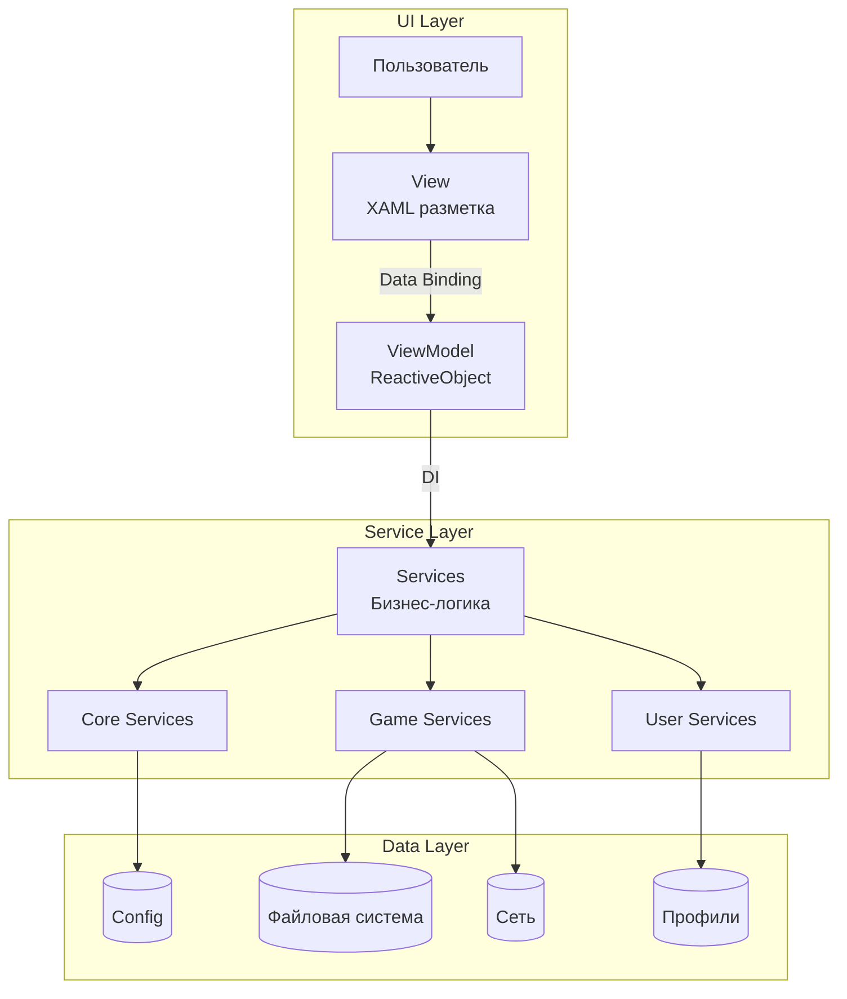
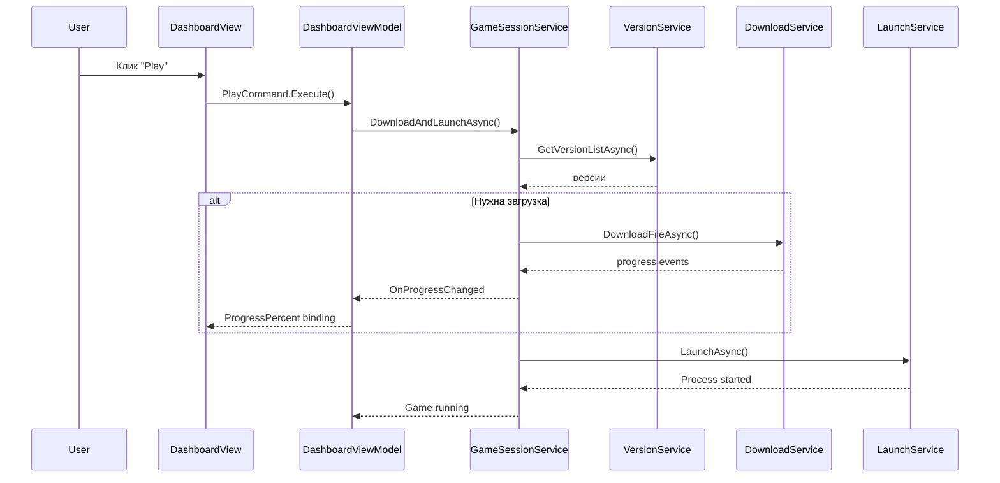
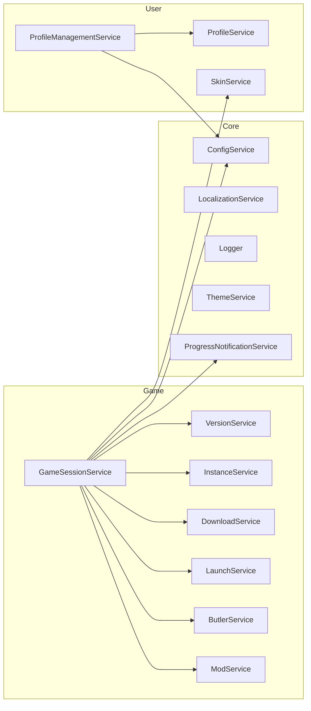

# Архитектура системы

HyPrism использует паттерн **Model-View-ViewModel (MVVM)** со строгим разделением UI и бизнес-логики.

> **Миграция:** Проект перешёл с Photino (WebKit) на Avalonia UI. См. [MigrationGuide.md](MigrationGuide.md).

---

## Содержание

- [Высокоуровневый обзор](#-высокоуровневый-обзор)
- [Слои архитектуры](#-слои-архитектуры)
- [Поток данных](#-поток-данных)
- [Dependency Injection](#-dependency-injection)
- [Структура ViewModel](#-структура-viewmodel)
- [Жизненный цикл приложения](#-жизненный-цикл-приложения)
- [Коммуникация между компонентами](#-коммуникация-между-компонентами)
- [Архитектурные принципы](#-архитектурные-принципы)

---

## 🏗️ Высокоуровневый обзор



---

## 📦 Слои архитектуры

### 1. Presentation Layer (UI)

**Расположение:** `UI/`

| Компонент | Описание |
|-----------|----------|
| **Views** | Полноэкранные XAML представления (`DashboardView`, `SettingsView`) |
| **Components** | Переиспользуемые UI элементы (`PrimaryButton`, `NewsCard`) |
| **MainWindow** | Главное окно и корневой `MainViewModel` |
| **Converters** | Value Converters для преобразования данных |
| **Styles** | Глобальные стили и анимации |

**Принципы:**
- Code-behind минимален (только конструктор)
- Вся логика в ViewModel
- Используется `x:DataType` для compile-time проверки binding

### 2. ViewModel Layer

**Расположение:** `UI/Views/*/`, `UI/MainWindow/`, `UI/Components/*/`

ViewModels наследуют `ReactiveObject` и используют:
- `[ObservableProperty]` — реактивные свойства
- `[RelayCommand]` — команды для UI
- `WhenAnyValue` — реактивные подписки
- `ObservableAsPropertyHelper` — вычисляемые свойства

**Ключевые ViewModel:**

| ViewModel | Ответственность |
|-----------|-----------------|
| `MainViewModel` | Корневой VM, владеет Loading и Dashboard |
| `DashboardViewModel` | Главный UI state, управление overlay-ами |
| `SettingsViewModel` | Настройки приложения |
| `LoadingViewModel` | Экран загрузки |

### 3. Service Layer

**Расположение:** `Services/`

Сервисы организованы по доменам:

```
Services/
├── Core/           # Инфраструктура (Config, Logger, Localization)
├── Game/           # Игровая логика (Launch, Download, Mods)
└── User/           # Пользователь (Profile, Skin)
```

**Принципы:**
- Singleton паттерн через DI
- Единая ответственность (SRP)
- Сервисы не зависят от UI

### 4. Model Layer

**Расположение:** `Models/`

Модели — простые POCO классы:
- `Config` — конфигурация приложения
- `Profile` — профиль пользователя
- `ModInfo` — информация о моде
- `InstalledInstance` — установленный инстанс игры

---

## 💉 Dependency Injection

HyPrism использует `Microsoft.Extensions.DependencyInjection`.

### Bootstrapper.cs

```csharp
public static class Bootstrapper
{
    public static IServiceProvider Initialize()
    {
        var services = new ServiceCollection();
        
        // Infrastructure
        services.AddSingleton(new AppPathConfiguration(appDir));
        services.AddSingleton<HttpClient>();
        
        // Core Services
        services.AddSingleton<ConfigService>();
        services.AddSingleton<LocalizationService>();
        services.AddSingleton<Logger>();
        
        // Game Services
        services.AddSingleton<GameSessionService>();
        services.AddSingleton<VersionService>();
        services.AddSingleton<LaunchService>();
        
        // User Services
        services.AddSingleton<ProfileService>();
        services.AddSingleton<SkinService>();
        
        // ViewModels
        services.AddSingleton<MainViewModel>();
        services.AddSingleton<DashboardViewModel>();
        services.AddTransient<SettingsViewModel>();
        
        return services.BuildServiceProvider();
    }
}
```

### Получение зависимостей

```csharp
// В App.axaml.cs
Services = Bootstrapper.Initialize();
var mainVm = Services.GetRequiredService<MainViewModel>();

// В ViewModel через конструктор
public DashboardViewModel(
    GameSessionService gameSession,
    ConfigService config,
    LocalizationService localization)
{
    _gameSession = gameSession;
    _config = config;
    _localization = localization;
}
```

---

## 📚 Библиотеки и зависимости

| Библиотека | Версия | Назначение |
|------------|--------|------------|
| **Avalonia** | 11.3.11 | UI Framework |
| **ReactiveUI** | 11.3.9 | Reactive MVVM |
| **CommunityToolkit.Mvvm** | 8.4.0 | Source Generators |
| **SkiaSharp** | 3.116.1 | Рендеринг графики |
| **Serilog** | 4.3.0 | Логирование |
| **Newtonsoft.Json** | 13.0.3 | JSON сериализация |
| **M.E.DependencyInjection** | 10.0.2 | DI контейнер |

---

## 🔄 Поток данных: Запуск игры



### Детальный процесс

1. **View:** Пользователь нажимает кнопку "Play"
2. **ViewModel:** `PlayCommand` вызывает `GameSessionService.DownloadAndLaunchAsync()`
3. **GameSessionService:**
   - Получает список версий через `VersionService`
   - Определяет целевую версию
   - Проверяет наличие игры через `InstanceService`
   - Загружает/обновляет через `ButlerService` + `DownloadService`
   - Применяет моды через `ModService`
   - Применяет скины через `SkinService`
   - Запускает через `LaunchService`
4. **ViewModel:** Подписан на `ProgressNotificationService.OnProgressChanged`
5. **View:** UI обновляется автоматически через binding

---

## 🗂️ Ключевые компоненты

### GameSessionService

**Файл:** `Services/Game/GameSessionService.cs` (~1000 строк)

Оркестратор всего процесса запуска игры. Координирует:
- Получение версий
- Скачивание и патчинг
- Применение модов и скинов
- Запуск процесса

### ClientPatcher

**Файл:** `Services/Game/ClientPatcher.cs`

⚠️ **Критический компонент** — бинарное патчирование исполняемого файла игры.

### LocalizationService

**Файл:** `Services/Core/LocalizationService.cs`

Реактивная система локализации с поддержкой hot-reload языка.

---

## 📐 Диаграммы

### Зависимости сервисов



---

## 📚 Дополнительные ресурсы

- [MigrationGuide.md](MigrationGuide.md) — Миграция с Photino
- [ServicesReference.md](ServicesReference.md) — Справочник сервисов
- [MVVMPatterns.md](../Development/MVVMPatterns.md) — Паттерны MVVM
- [ProjectStructure.md](ProjectStructure.md) — Структура проекта
