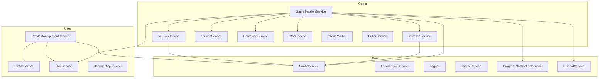

# Справочник сервисов

> Полный справочник по всем сервисам HyPrism с описанием их ответственности, зависимостей и примерами использования.

---

## Содержание

- [Структура сервисов](#-структура-сервисов)
- [Core Services](#-core-services)
  - [ConfigService](#configservice)
  - [LocalizationService](#localizationservice)
  - [Logger](#logger)
  - [ThemeService](#themeservice)
  - [ProgressNotificationService](#progressnotificationservice)
  - [NewsService](#newsservice)
  - [DiscordService](#discordservice)
- [Game Services](#-game-services)
  - [GameSessionService](#gamesessionservice)
  - [InstanceService](#instanceservice)
  - [VersionService](#versionservice)
  - [LaunchService](#launchservice)
  - [DownloadService](#downloadservice)
  - [ModService](#modservice)
  - [ClientPatcher](#clientpatcher)
  - [ButlerService](#butlerservice)
- [User Services](#-user-services)
  - [ProfileService](#profileservice)
  - [ProfileManagementService](#profilemanagementservice)
  - [SkinService](#skinservice)
  - [UserIdentityService](#useridentityservice)
- [Диаграмма зависимостей](#-диаграмма-зависимостей)
- [Добавление нового сервиса](#-добавление-нового-сервиса)

---

## 📁 Структура сервисов

```
Services/
├── Core/           # Базовые сервисы инфраструктуры
├── Game/           # Сервисы для работы с игрой
└── User/           # Сервисы пользователя
```

---

## 🔧 Core Services

### ConfigService

**Файл:** `Services/Core/ConfigService.cs`  
**Тип:** Singleton  
**Ответственность:** Чтение и запись конфигурации приложения

```csharp
public class ConfigService
{
    public Config Configuration { get; }
    public void Save();
    public void Reload();
}
```

**Использование:**
```csharp
// Чтение настройки
var language = _configService.Configuration.Language;

// Изменение и сохранение
_configService.Configuration.AccentColor = "#FF5500";
_configService.Save();
```

**Путь к файлу конфигурации:**
- Windows: `%APPDATA%/HyPrism/config.json`
- Linux: `~/.config/HyPrism/config.json`
- macOS: `~/Library/Application Support/HyPrism/config.json`

---

### LocalizationService

**Файл:** `Services/Core/LocalizationService.cs`  
**Тип:** Singleton (Instance pattern)  
**Ответственность:** Система локализации с реактивными обновлениями

```csharp
public class LocalizationService : ReactiveObject
{
    public static LocalizationService Instance { get; }
    public string CurrentLanguage { get; set; }
    
    public string Translate(string key);
    public IObservable<string> GetObservable(string key);
    public static Dictionary<string, string> GetAvailableLanguages();
}
```

**Использование в ViewModel:**
```csharp
// Простой перевод
var text = LocalizationService.Instance.Translate("button.play");

// Реактивный перевод (обновляется при смене языка)
LocalizationService.Instance.GetObservable("button.play")
    .Subscribe(text => PlayButtonText = text);
```

**Использование в XAML:**
```xml
<!-- Через конвертер -->
<TextBlock Text="{Binding Source={x:Static core:LocalizationService.Instance}, 
                          Path=CurrentLanguage, 
                          Converter={StaticResource TranslateConverter}, 
                          ConverterParameter=button.play}"/>
```

**Формат файлов локализации:** `Assets/Locales/{code}.json`
```json
{
  "_langName": "Русский",
  "_langCode": "ru-RU",
  "button": {
    "play": "Играть",
    "settings": "Настройки"
  }
}
```

---

### Logger

**Файл:** `Services/Core/Logger.cs`  
**Тип:** Static class  
**Ответственность:** Централизованное логирование

```csharp
public static class Logger
{
    public static void Info(string category, string message);
    public static void Success(string category, string message);
    public static void Warning(string category, string message);
    public static void Error(string category, string message);
    public static void Debug(string category, string message);
    public static void Progress(string category, int percent, string message);
    public static List<string> GetRecentLogs(int count = 10);
}
```

**Использование:**
```csharp
Logger.Info("Download", "Starting download...");
Logger.Success("Download", "Download completed!");
Logger.Error("Download", $"Failed: {ex.Message}");
Logger.Progress("Download", 50, "Downloading game files");
```

**Вывод:** Консоль + файл `Logs/{timestamp}.log`

---

### ThemeService

**Файл:** `Services/Core/ThemeService.cs`  
**Тип:** Singleton (Instance pattern)  
**Ответственность:** Управление темами и акцентными цветами

```csharp
public class ThemeService
{
    public static ThemeService Instance { get; }
    public void Initialize(string hexColor);
    public void ApplyAccentColor(string hexColor);
}
```

**Использование:**
```csharp
// При старте приложения
ThemeService.Instance.Initialize("#FFA845");

// При изменении в настройках
ThemeService.Instance.ApplyAccentColor(newColor);
```

---

### ProgressNotificationService

**Файл:** `Services/Core/ProgressNotificationService.cs`  
**Тип:** Singleton  
**Ответственность:** Централизованные уведомления о прогрессе

```csharp
public class ProgressNotificationService
{
    public event Action<DownloadProgress>? OnProgressChanged;
    
    public void ReportDownloadProgress(
        string phase, 
        int progress, 
        string message,
        string? detail = null,
        long downloadedBytes = 0,
        long totalBytes = 0);
}
```

**Использование:**
```csharp
// В сервисе
_progressService.ReportDownloadProgress(
    "download", 
    50, 
    "Downloading game files...",
    "file.zip",
    1024 * 1024 * 50, // 50MB downloaded
    1024 * 1024 * 100  // 100MB total
);

// В ViewModel - подписка
_progressService.OnProgressChanged += progress =>
{
    DownloadProgress = progress.Percent;
    StatusText = progress.Message;
};
```

---

### NewsService

**Файл:** `Services/Core/NewsService.cs`  
**Тип:** Singleton  
**Ответственность:** Загрузка и кэширование новостей

```csharp
public class NewsService
{
    public Task<List<NewsItem>> GetNewsAsync(int count = 10);
    public List<NewsItem> GetCachedNews();
}
```

---

### DiscordService

**Файл:** `Services/Core/DiscordService.cs`  
**Тип:** Singleton  
**Ответственность:** Discord Rich Presence

```csharp
public class DiscordService
{
    public void Initialize();
    public void UpdatePresence(string state, string details = null);
    public void ClearPresence();
    public void Dispose();
}
```

**Использование:**
```csharp
_discordService.Initialize();
_discordService.UpdatePresence("In Launcher", "Browsing mods");

// При запуске игры
_discordService.UpdatePresence("Playing Hytale", $"Version {version}");
```

---

## 🎮 Game Services

### GameSessionService

**Файл:** `Services/Game/GameSessionService.cs`  
**Тип:** Singleton  
**Ответственность:** Оркестрация полного цикла запуска игры

**Зависимости:**
- ConfigService, InstanceService, VersionService
- UpdateService, LaunchService, ButlerService
- DownloadService, ModService, SkinService
- UserIdentityService, GameProcessService
- ProgressNotificationService, DiscordService

```csharp
public class GameSessionService
{
    public Task<DownloadProgress> DownloadAndLaunchAsync(
        Func<bool>? launchAfterDownloadProvider = null);
    public void RequestCancel();
}
```

**Поток выполнения:**
1. Получение списка версий
2. Определение целевой версии
3. Проверка установленности игры
4. Загрузка/обновление при необходимости
5. Применение модов и скинов
6. Запуск игрового процесса

---

### InstanceService

**Файл:** `Services/Game/InstanceService.cs`  
**Тип:** Singleton  
**Ответственность:** Управление игровыми инстансами (версиями)

```csharp
public class InstanceService
{
    public string ResolveInstancePath(string branch, int version, bool preferExisting);
    public bool IsClientPresent(string instancePath);
    public void SaveLatestInfo(string branch, int version);
    public LatestInstanceInfo? LoadLatestInfo(string branch);
    public void MigrateLegacyData();
}
```

**Структура директорий:**
```
{AppDir}/
├── Instances/
│   ├── release/
│   │   ├── latest/        # Автообновляемый инстанс
│   │   ├── v123/          # Закреплённая версия
│   │   └── v124/
│   └── pre-release/
│       └── latest/
```

---

### VersionService

**Файл:** `Services/Game/VersionService.cs`  
**Тип:** Singleton  
**Ответственность:** Работа с версиями игры

```csharp
public class VersionService
{
    public Task<List<int>> GetVersionListAsync(string branch);
    public List<int> GetPatchSequence(int fromVersion, int toVersion);
    public string GetPatchUrl(string branch, int version);
}
```

---

### LaunchService

**Файл:** `Services/Game/LaunchService.cs`  
**Тип:** Singleton  
**Ответственность:** Подготовка и запуск игрового процесса

```csharp
public class LaunchService
{
    public ProcessStartInfo BuildProcessStartInfo(
        string executablePath,
        LaunchOptions options);
    public Task<Process?> LaunchAsync(ProcessStartInfo startInfo);
}
```

---

### DownloadService

**Файл:** `Services/Game/DownloadService.cs`  
**Тип:** Singleton  
**Ответственность:** Загрузка файлов с прогрессом

```csharp
public class DownloadService
{
    public Task DownloadFileAsync(
        string url,
        string destinationPath,
        Action<long, long>? progressCallback = null,
        CancellationToken cancellationToken = default);
}
```

---

### ModService

**Файл:** `Services/Game/ModService.cs`  
**Тип:** Singleton  
**Ответственность:** Управление модами

```csharp
public class ModService
{
    public Task<List<ModInfo>> SearchModsAsync(string query);
    public Task<ModInfo?> GetModDetailsAsync(string modId);
    public Task InstallModAsync(ModInfo mod, string instancePath);
    public Task UninstallModAsync(string modId, string instancePath);
    public List<InstalledMod> GetInstalledMods(string instancePath);
}
```

---

### ClientPatcher

**Файл:** `Services/Game/ClientPatcher.cs`  
**Тип:** Utility class  
**Ответственность:** Бинарное патчирование игрового клиента

> ⚠️ **КРИТИЧЕСКИЙ КОМПОНЕНТ** — Изменяйте только с полным пониманием последствий!

```csharp
public static class ClientPatcher
{
    public static bool Patch(string executablePath, PatchConfig config);
    public static bool Verify(string executablePath);
    public static bool Restore(string executablePath);
}
```

---

### ButlerService

**Файл:** `Services/Game/ButlerService.cs`  
**Тип:** Singleton  
**Ответственность:** Интеграция с itch.io Butler для дифференциальных обновлений

```csharp
public class ButlerService
{
    public Task EnsureButlerInstalledAsync(Action<int, string> progressCallback);
    public Task ApplyPatchAsync(string patchPath, string targetDir);
}
```

---

## 👤 User Services

### ProfileService

**Файл:** `Services/User/ProfileService.cs`  
**Тип:** Singleton  
**Ответственность:** Хранение и загрузка данных профилей

```csharp
public class ProfileService
{
    public Profile? GetActiveProfile();
    public List<Profile> GetAllProfiles();
    public void SaveProfile(Profile profile);
    public void DeleteProfile(string uuid);
}
```

---

### ProfileManagementService

**Файл:** `Services/User/ProfileManagementService.cs`  
**Тип:** Singleton  
**Ответственность:** Высокоуровневые операции с профилями

```csharp
public class ProfileManagementService
{
    public void InitializeProfileModsSymlink();
    public void SwitchProfile(int profileIndex);
    public Profile CreateNewProfile(string name);
}
```

---

### SkinService

**Файл:** `Services/User/SkinService.cs`  
**Тип:** Singleton  
**Ответственность:** Пользовательские скины

```csharp
public class SkinService
{
    public void TryRecoverOrphanedSkinOnStartup();
    public Task ApplySkinAsync(string instancePath, string skinPath);
    public string? GetCurrentSkinPath();
}
```

---

### UserIdentityService

**Файл:** `Services/User/UserIdentityService.cs`  
**Тип:** Singleton  
**Ответственность:** Идентификация пользователя (UUID, никнейм)

```csharp
public class UserIdentityService
{
    public string GetOrCreateUUID(string username);
    public string CurrentUsername { get; set; }
    public string CurrentUUID { get; }
}
```

---

## 🔗 Диаграмма зависимостей



---

## 📝 Добавление нового сервиса

1. **Создайте класс** в соответствующей папке (`Core/`, `Game/`, `User/`)
2. **Определите зависимости** через конструктор
3. **Зарегистрируйте в Bootstrapper.cs:**

```csharp
// В методе Initialize()
services.AddSingleton<MyNewService>();

// или с фабрикой
services.AddSingleton(sp => new MyNewService(
    sp.GetRequiredService<ConfigService>(),
    sp.GetRequiredService<AnotherService>()
));
```

4. **Инжектируйте** в ViewModel или другие сервисы
