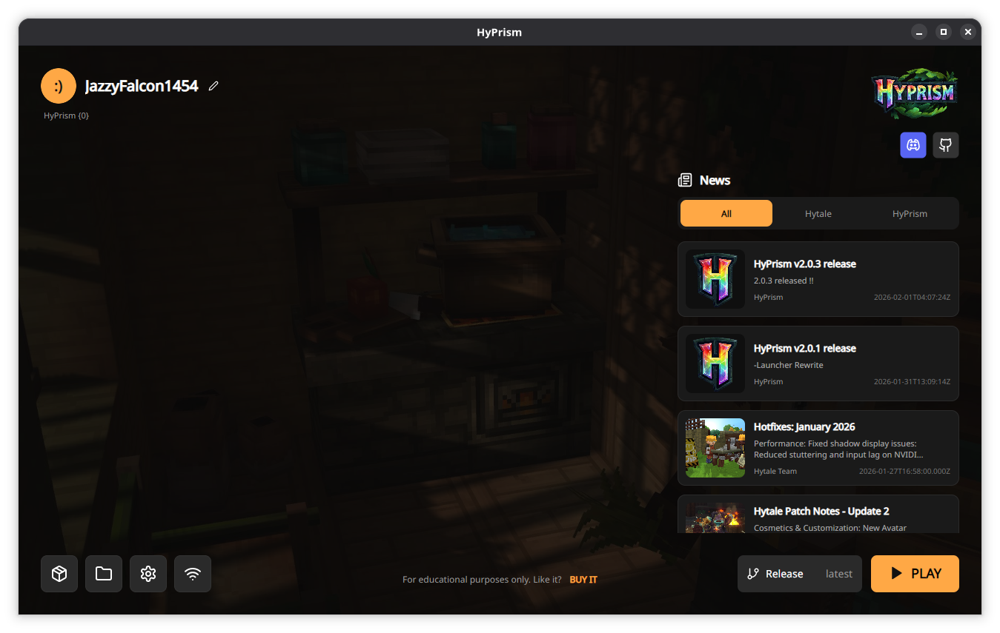

# HyPrism

  **Free-to-Play multiplatform Hytale launcher with mod manager and more!**

  [](https://github.com/yyyumeniku/HyPrism/releases)
  [](https://yyyumeniku.github.io/hyprism-site/)
  [](https://discord.gg/ekZqTtynjp)
  [](https://buymeacoffee.com/yyyumeniku)





> ⚠️ Disclaimer: HyPrism has no any connection to [PrismLauncher](https://github.com/PrismLauncher/PrismLauncher). HyPrism is an application that is being developed **INDEPENDENTLY** of the PrismLauncher project or its team. Thank you for your understanding

## ✨ Features

- **Multiplatform**: Runs on Windows, Linux, and macOS.
- **Mod Management**: Integrated mod manager for easy installation and updates.
- **Profile System**: Manage multiple profiles and configurations.
- **Instance Management**: Support for Release, Pre-Release, and custom instances.
- **Localization**: Available in multiple languages.
- **Modern UI**: Clean and responsive interface built with Avalonia UI.

## 📥 Installation

Downloads are available in [Releases](https://github.com/yyyumeniku/HyPrism/releases).

**Linux Users:**
For older Linux distributions, the **Flatpak** is the recommended solution.
```bash
# One-line installer (coming soon)
```

## 🛠️ Build Instructions

**Requirements:**
- .NET 10.0 SDK

**Build:**
```bash
# Clone the repository
git clone https://github.com/yyyumeniku/HyPrism.git
cd HyPrism

# Build the project
dotnet build

# Run the launcher
dotnet run
```

## 🤝 Credits & Contributors

Special thanks to **Sanasol** for maintaining and creating the [auth server](https://github.com/sanasol/hytale-auth-server).

<a href="https://github.com/yyyumeniku/HyPrism/graphs/contributors">
  
</a>

<div align="center">
  <sub>Made with ❤️ by the HyPrism Community</sub>
</div>
